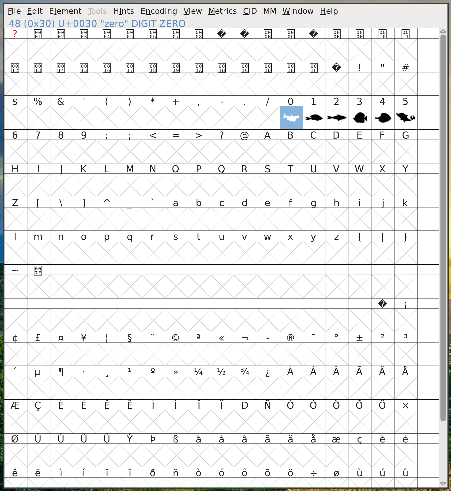

# Create font from SVG images (tutorial)

Given a set of SVG images, create a font to use them as symbols, e.g. in a LaTeX presentation.


## Building

1. Install Scour:

```
python3 -m venv ./venv
source ./venv/bin/activate.fish
pip install git+https://github.com/scour-project/scour.git
```

2. Use Scour to optimize SVG images:

```
mkdir output
cd input
find . -name "*.svg" -exec scour -i {} -o ../output/{} \;
```

3. Use FontForge to create the font

* Click `Element -> Font Info` and assign a font name
* Import SVG image into each glyph
* Generate font



4. Use font in XeLaTeX

```latex
\documentclass{article}

\usepackage{geometry}
\usepackage{fontspec}
\usepackage{xcolor}

\geometry{
  paperheight=1.5cm\relax,
  paperwidth=7.5cm\relax,
  marginparwidth=0.5cm,
  left=0.5cm,
  top=0.5cm
}

\newfontfamily\fish[%
    Path = {./} ,
    Extension = .otf ,
    UprightFont = * ,
    ]{Fish}

\begin{document}

\pagenumbering{gobble}

\textcolor{orange}{\fish \Huge 012345}

\end{document}
```

```
xelatex test.tex
```

5. Make a screenshot

```
convert -units pixelspercentimeter -density 600 test.pdf screenshot.png
```
